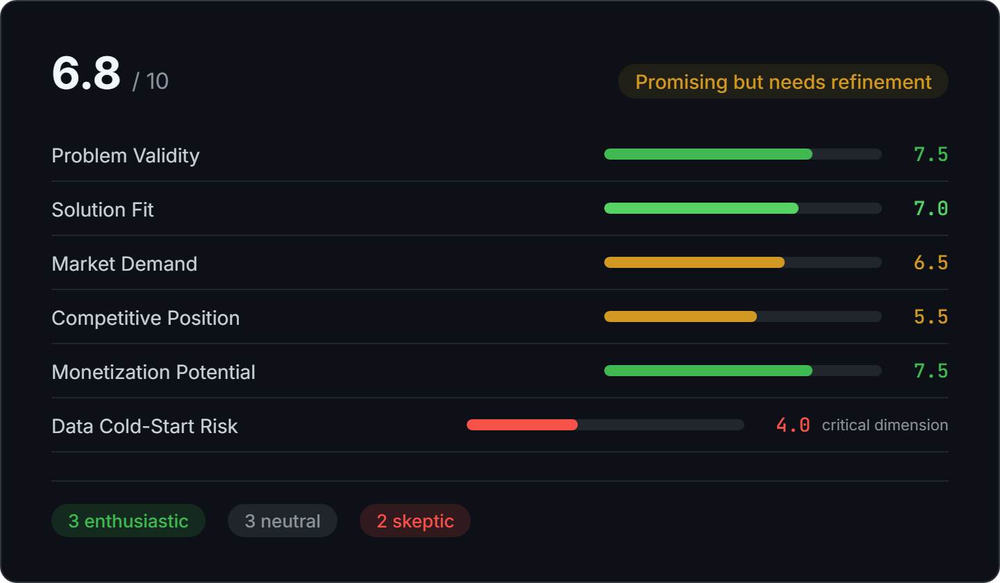
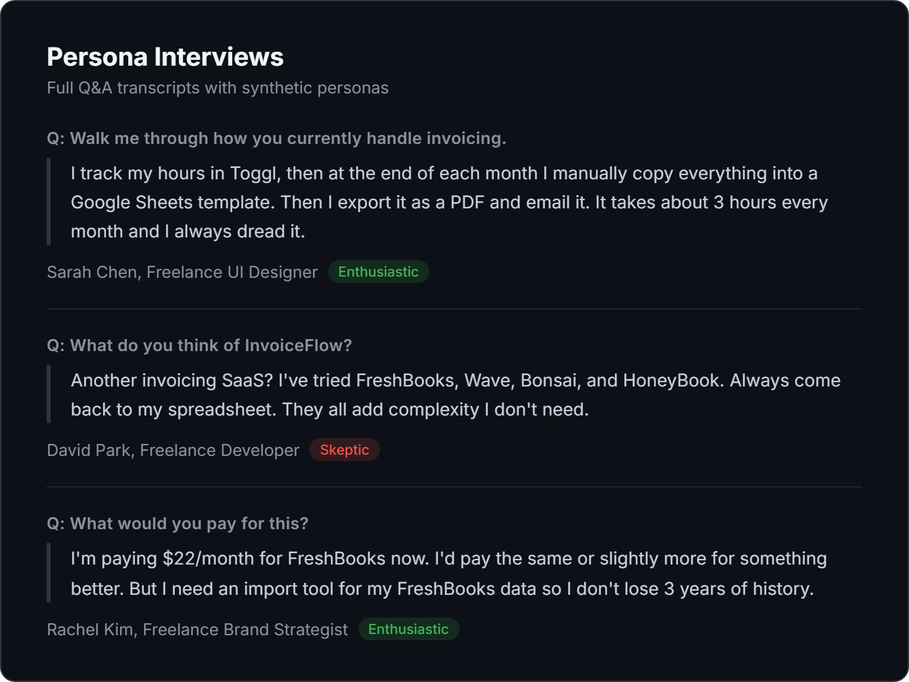
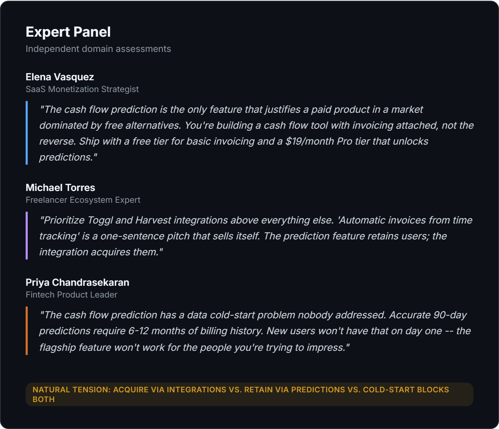

<p align="center">
  
</p>

<h1 align="center">Early Feedback</h1>

<p align="center"><strong>Get honest feedback on your product idea before you build it.</strong></p>
<p align="center"><code>v1.7.3</code> · 217 tests · MIT License</p>

Describe your idea, drop in a pitch deck, or point it at a codebase. Early Feedback interviews synthetic users, assembles a domain expert panel, and tells you what's actually wrong — before you spend months finding out the hard way.

We fed it "a freelancer invoicing tool with cash flow prediction." It came back 6.8/10 and flagged a cold-start problem nobody mentioned — the flagship feature needs 6 months of data to work, which new users don't have. That's the kind of thing a friend with domain expertise would catch over coffee. Now you can get it on demand.

---

## Demo

<p align="center">
  
</p>

Scored across standard dimensions plus product-specific critical dimensions identified automatically.

<p align="center">
  
</p>

Full Q&A transcripts — not summaries. Enthusiasts voice concerns. Skeptics acknowledge strengths.

<p align="center">
  
</p>

Independent expert assessments. When their conclusions conflict, the tension is preserved.

---

## Why Early Feedback

Most feedback on early-stage ideas is either too polite or too shallow. Friends say "sounds cool." Investors ask about traction you don't have yet. Early Feedback gives you the conversation you *need* — honest, specific, and structured around the questions that actually matter.

### Grounded in research methodology

The pipeline adapts established UXR and product evaluation methods for synthetic research:

- **Assumption mapping** (McGrath & MacMillan) — ranks hypotheses by importance × uncertainty, targets interviews at leap-of-faith assumptions
- **Loss framing** (Kahneman & Tversky) — probes switching costs and sunk costs, not just feature appeal. Losses weighted ~2× gains in adoption verdicts.
- **Adoption profiling** (Rogers' diffusion) — personas span innovators through late majority, with at least 2 pragmatists who need proven ROI before switching
- **Pre-mortem analysis** (Klein) — experts imagine the product failed after 12 months and generate failure reasons, counteracting structural optimism
- **Feature classification** (Kano model) — distinguishes must-be features (table stakes) from attractive features (differentiators)
- **Forced feature ranking** (MaxDiff-inspired) — personas choose their most and least important feature instead of rating everything as important

### Honest about limitations

Early Feedback is a **hypothesis engine, not a research substitute.** Every report includes a confidence calibration section that labels what's directionally reliable (sentiment patterns, deal-breakers), what's uncertain (adoption percentages, market sizing), and what should be treated as hypotheses (tail-end behaviors, competitive responses). The HCI literature shows synthetic personas produce believable but variance-compressed outputs — they'll catch the obvious problems, but real user research catches the surprises. Use this to know which questions to ask, then go ask real people.

---

## Quick Start

### Claude Code (full features)

```bash
git clone https://github.com/bweller-lgtm/early-feedback
cd early-feedback
```

```
/evaluate A marketplace for freelance data scientists with built-in project scoping and escrow

/evaluate pitch-deck.pdf

/evaluate ../my-startup/

/evaluate --deep ../my-startup/
```

Handles file/directory scanning, config files, web research, and automatic report saving.

### Claude Desktop / API (core evaluation)

Copy the contents of `evaluate/SKILL.md` (everything after the frontmatter) into any Claude conversation. Replace `$ARGUMENTS` with your idea description. You get the full evaluation pipeline — personas, interviews, expert panel, scored report — without the file I/O features.

### What to expect

A full evaluation takes **10-20 minutes** and uses **~100K output tokens**. The pipeline runs 8 steps — web research, persona generation, interviews, viability check, expert panel, follow-ups, synthesis, and report writing. Each step prints progress as it goes, so you'll see work happening throughout.

Use `--no-web-search --no-experts` for a faster ~5 minute evaluation with personas and interviews only.

---

## What You Can Evaluate

| Input | Example | What happens |
|---|---|---|
| **A one-liner** | `/evaluate An app that...` | Evaluates the description directly |
| **A pitch deck** | `/evaluate pitch-deck.pdf` | Reads the PDF and evaluates |
| **A codebase** | `/evaluate ./my-project/` | Reads all project files and synthesizes the idea |
| **A doc** | `/evaluate idea.docx` | Supports `.pdf`, `.docx`, `.pptx`, `.xlsx`, code files |
| **A mockup** | `/evaluate wireframe.png` | Reads images (`.png`, `.jpg`) — wireframes, screenshots, diagrams |

Web research runs automatically. Add `--deep` for a full research report with TAM/SAM, GTM playbook, and experiments to run.

---

## What You Get

| Output | File | When |
|---|---|---|
| **Evaluation report** | `outputs/YYYY-MM-DD-product-name.md` | Always |
| **Critical issues report** | `outputs/YYYY-MM-DD-product-name-critical.md` | If the idea fails the viability gate |
| **Deep research report** | `outputs/YYYY-MM-DD-product-name-deep-research.md` | With `--deep` flag |
| **HTML report** | `outputs/YYYY-MM-DD-product-name.html` | `python render_report.py outputs/*.md` |

Each report includes: Executive Summary, Scored Breakdown, Key Findings with quotes, Expert Assessments, Audience Segmentation, Risks and Concerns, Recommendations, and Full Interview Transcripts.

| Flag | What it does |
|---|---|
| `--no-web-search` | Skip web research (faster, no internet needed) |
| `--no-experts` | Skip expert panel (faster, persona-only evaluation) |
| `--deep` | Add a deep research report (TAM/SAM, GTM playbook, experiments) |
| `--full` | Force full pipeline even if viability gate triggers early termination |

<details>
<summary><strong>Scoring Framework</strong></summary>

| Dimension | 8+ (Strong) | 6-7 (Solid) | 4-5 (Moderate) | <4 (Weak) |
|---|---|---|---|---|
| Problem Validity | Universal pain | Clear pain, limited scope | Nice-to-have | Solution looking for problem |
| Solution Fit | Elegant fit | Good fit, gaps remain | Partial | Mismatch |
| Market Demand | Large eager market | Mid-size or growing | Niche | Too small or shrinking |
| Competitive Position | Clear differentiation | Differentiated but contested | Crowded but viable | Dominated |
| Monetization Potential | Paid market precedent, strong switching motivation | Some paid alternatives, moderate pain | Free alternatives dominate, low urgency | No monetization path evident |

| Overall Score | Verdict |
|---|---|
| 7.5+ | Strong opportunity — pursue with confidence |
| 5.5 - 7.4 | Promising but needs refinement |
| 3.5 - 5.4 | Significant concerns — pivot or validate further |
| < 3.5 | Reconsider fundamentally |

</details>

<details>
<summary><strong>How It Works (8 steps + conditional branches)</strong></summary>

```
Preamble   Parse flags and optional config
Step 1     Parse product context + assumption mapping (flag gaps, don't infer)
Step 1.5   Web research (on by default, skip with --no-web-search)
Step 2     Generate personas (organic sentiment, Rogers adoption tags, status quo attachment)
Step 3     Simulate interviews (loss framing, forced feature ranking, assumption-targeted Qs)
Step 3.5   Viability gate — kill bad ideas early (unless --full)
Step 4     Expert panel review (configurable, skippable)
Step 5     Follow-up interviews from expert questions
Step 6     Pre-mortem + expert synthesis + Kano feature classification
Step 7     Generate scored report + confidence calibration
Step 8     Deep research report (conditional: --deep)
```

</details>

---

## Tests

<details>
<summary><strong>217 tests</strong> — scoring, honesty guardrails, organic sentiment, viability gate, expert panel, parallel execution, research grounding, benchmark comparison, configuration, report structure</summary>

```bash
pip install pytest
python -m pytest tests/ -v
```

Validate any generated report:

```bash
python tests/validate_report.py outputs/YYYY-MM-DD-my-product.md
```

</details>

---

## Project Structure

```
evaluate/SKILL.md               # The skill (Agent Skills standard format)
.claude/commands/evaluate.md    # Legacy command (keeps /evaluate working without plugin install)
render_report.py                # Convert markdown reports to styled HTML
tests/
  test_skill_content.py         # Skill methodology + SKILL.md format validation
  test_report_format.py         # Report structure validation
  validate_report.py            # Standalone CLI report validator
  conftest.py                   # Shared fixtures and sample report
outputs/                        # Generated reports (gitignored)
```

---

## Advanced

<details>
<summary><strong>All flags</strong></summary>

| Flag | What it does |
|---|---|
| `--no-web-search` | Skip web research (on by default) |
| `--deep` | Produce a deep research report (TAM/SAM, competitive landscape, GTM playbook, experiments) |
| `--experts N` | Set expert count (1-5, default 3) |
| `--personas N` | Set persona count (4-12, default 8) |
| `--no-experts` | Skip expert panel (faster, persona-only evaluation) |
| `--full` | Force full pipeline even if viability gate triggers early termination |
| `--questions path` | Load custom interview questions from a file |
| `--config path` | Use alternate config file |
| `--research path` | Load prior user research from a directory to ground personas |

</details>

<details>
<summary><strong>Configuration file</strong></summary>

Create an optional `evaluate.config.yaml` for persistent settings:

```yaml
experts:
  count: 4
  custom:
    - name: "Jane Smith"
      domain: "Marketplace strategy & network effects"
      credentials: "Former VP Growth at a top marketplace startup"

personas:
  count: 10
  must_include:
    - "enterprise buyer at Fortune 500"

required_questions:
  - "How does this compare to your current Salesforce workflow?"

web_research: true
deep_report: false

scoring:
  additional_dimensions:
    - name: "Regulatory Risk"
      strong: "Clear regulatory path"
      moderate: "Some ambiguity"
      weak: "Major regulatory barriers"
```

</details>

<details>
<summary><strong>External files</strong></summary>

Place these optional files in the project root to customize evaluations:

- `experts.md` — Detailed expert profiles that override auto-selection
- `questions.md` — Custom questions included in every interview
- `context.md` — Additional market context factored into all analysis steps
- `research/` — Prior user research (interview transcripts, survey results, support logs, previous reports). Personas are grounded in this data — real demographics, real quotes, real segment distributions. Gaps between your data and generated personas are flagged.

</details>
